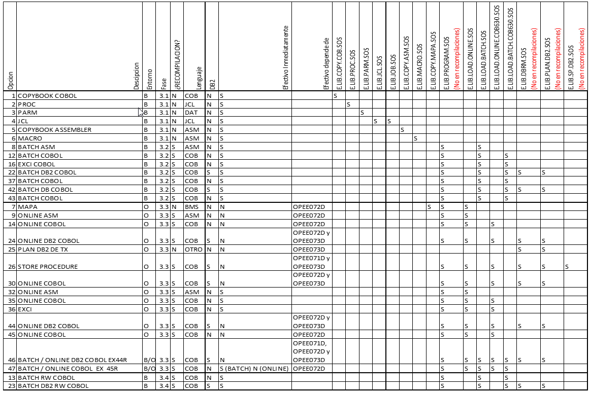
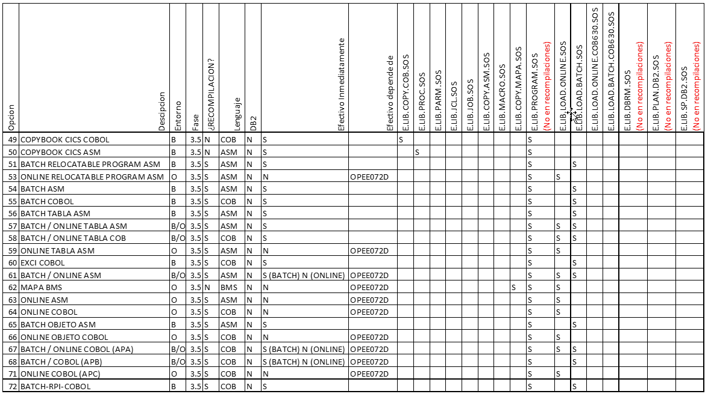

# BACKUP DE COMPONENTES 

**Descripción:**  
Cuando se hace una migración, se hacen backup previos para poder hacer un **rollback** en caso algo haya fallado. A continuacion se describe cada componente y sobre que se hace backup.

 
 

